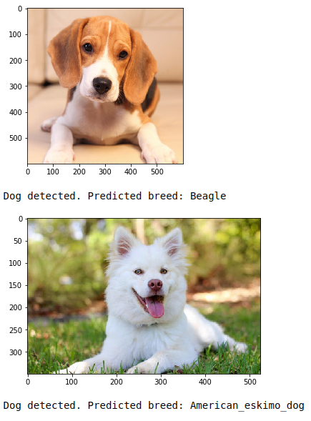
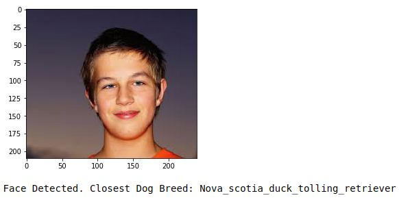

# Dog_Breed_Classifier
Predict breed of a dog from image using Convolutional Neural Network (CNN)

## Table of Contents
 <ol>
   <li><a href="#head1"> Libraries and tools used</a>
   <li><a href="#head2"> Motivation of the project </a>
   <li><a href="#head3"> Instructions </a>
   <li><a href="#head4"> Summary of the results </a>
   <li><a href="#head5"> Acknowledgements </a>
   <li><a href="#head6"> Author </a>
</ol>

<h2 id="head1"> Libraries and tools used: </h2>
<ul>
 <li> os
 <li> random
 <li> numpy
 <li> matplotlib
 <li> sklearn 
 <li> skimage
 <li> keras    
 <li> glob
 <li> tqdm
 <li> ImageFile
</ul>

<h2 id="head2"> Motivation of the project</h2>
To apply deep learning skills learned as part of Udacity Machine Learning Nanodegree lesson to identify breed of a dog from image.

<h2 id="head3"> Instructions </h2>

1. Specify the path for training, validation and test image folders. In each of the training, validation and test folders - the images must be in sub-folders named by the breed. Specify path for extracted features for pre-trained models you want to use for transfer learning.

2. Run cells under Step 2 and 3 only if interested in: (i) Experiencing how transfer leaning expediates the process (ii) How different pre-trained models perform corparatively

3. Run cells under step 4 and 5 to see results of CNN model.

<h2 id="head4"> Summary of the results </h2>
For test images, if a dog is detected in the image - the ouput is the predicted dog breed.

If a human face is detected then the closest dog breed is predicted.

<h2 id="head5"> Acknowledgements </h2>

<ul>
 <li> Udacity https://www.udacity.com/
</ul>

<h2 id="head7"> Author </h2>

Shahzeb Akhtar
https://www.linkedin.com/in/shahzebakhtar/
